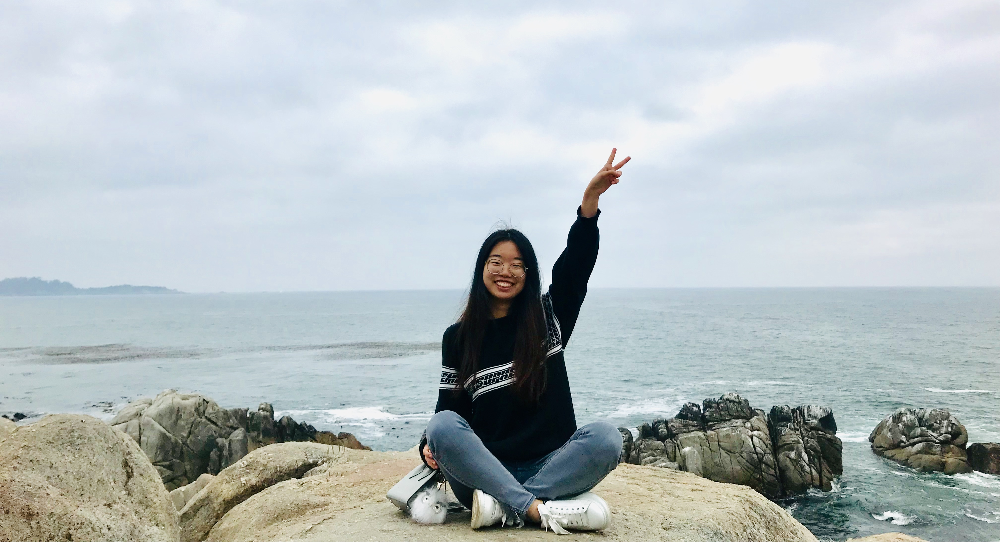

```{r setup, include=FALSE}
knitr::opts_chunk$set(echo = TRUE)
```
<style>
.column {
  float: left;
  padding: 10px;
}

.left {
  width: 30%;
}

.right {
  width: 70%;
}

.row:after {
  content: "";
  display: table;
  clear: both;
}

</style>

<br><br><br>

<center>

<h2>About me&emsp;</h2>

</center>

<br><br><br>



<div class="row">
  <div class="column left" align="center">
  <h2>Intro</h2>
  <br><br>
    
  </div>
  <div class="column right">
  <p>Passionate about <font color="lightpink">conservation planning</font> and <font color="skyblue">environmental management</font>, Shuhan is currently studying **Environmental Science and Management** at Bren School at UCSB in the completion of her master's degree. She is seeking a career that will create and protect a more <i><font color="forestgreen">sustainable</font>, <font color="lightseagreen">diverse</font>, and <font color="indianred">productive</font> <strong>ecosystem</strong></i>. She loves being in the <font color="seagreen">field</font> to observe and learn no less than sitting in front of a <font color="darksalmon">computer</font> to code and map. Born in Beijing, China, Shuhan speaks both <font color="steelblue">English and Mandarin</font>. In her free time, she enjoys <font color="palevioletred">drawing</font>, <font color="olivedrab">hiking</font>, <font color="mediumorchid">visiting museums</font>, and <font color="plum">listening to jazz and violin solo</font> (link to [Violin Concerto No1. in D major by Mengla Huang and the string quintet](https://www.youtube.com/watch?v=rNM1CkCfjsk)). Fun fact: She has been a big fan of [Pablo Ruiz Picasso](about_me/picasso.JPG) since the age of five.
  </p>
  </div>
</div>

<div class="row">
  <div class="column left" align="center">

  <h2>Education</h2>
  </div>
  <div class="column right">
  <h4>**Master of Environmental Science and Management**
  <small class="text-muted">3.90 GPA (June 2021)
  </small>
  </h4> 
  <h5>Bren School of Environmental Science & Management – University of California, Santa Barbara</h5>
  <ul>
  <p><u>Specialization</u>: Conservation Planning | Focus: Environmental Data Science 
  </p>
  <p><u>Highlighted Coursework</u>: GIS | Machine Learning | Advanced Data Analysis | Ecological Restoration  
  </p>
  </ul>
  
  <br>
  
  <h4>**Bachelor of Science in Environmental Sciences**
  <small class="text-muted">3.87 GPA (May 2019)
  </small>
  </h4> 
  <h5>University of California, Berkeley</h5>
  <ul>
  <p><u>Honor/Awards</u>: High Distinction in College of Natural Resources | Honors in Environmental Sciences| Dean’s List (Spring 2018)
  </p>
  <p><u>Thesis</u>: [Assessing the Impact of Climate and Snowpack on the Distribution of Amphibian Species in Sierra Nevada](paper/amphibian_thesis.pdf)
  </p>
  <p><u>Highlighted Skills</u>: Species distribution modeling (Maxent) | [Remote Sensing for Conservation & Biodiversity Certification](about_me/NASA_certificate_Shuhan Song.pdf), NASA’s Training Program (January 2019)
  </p>
  </ul>

<br>

  <h4>**Associate of Science in Mathematics**
  <small class="text-muted">3.94 GPA (June 2017)
  </small>
  </h4>
  <h5>East Los Angeles College</h5>
  <ul>
  <p><u>Honor/Awards</u>: President’s Award (9/15-6/17) | Dean’s Honor List (9/14-6/17)
  </p>
  </ul>
  </div>
</div>

<div class="row">
  <div class="column left" align="center">
  <h2>Skills</h2>
  </div>
  <div class="column right">
  <h4>**Computer**</h4> 
  <ul>
  <p>GIS | Maxent | R | Photoshop | InDesign | Microsoft Office
  </p>
  </ul>
  <h4>**Language**</h4> 
  <ul>
  <p>English (fluent in speaking & writing with 17+ years learning experience) | Mandarin (native speaker) 
  </p>
  </ul>

  </div>
</div>

<div class="row">
  <div class="column left" align="center">
  <h2>Experience</h2>
  </div>
  <div class="column right">
  <h4>**Field Assistant**
  <small class="text-muted"> China (7/19) 
  </small>
  </h4> 
  <h5>Qianyanzhou Ecological Research Station, Chinese Academy of Science</h5>
  <ul>
  <li>Resurveyed 4000+ pioneer pines (Masson’s Pine and Slash Pine) in 36 forest plantation plots for a landscape restoration program to evaluate tree growth and canopy change by measuring breast height diameter, crown width, and crown closure in collaboration with a 12-member research team.</li>
  <li>Assembled species diversity data and total coverage data of herbaceous plants and young woody plants to examine the underfloor development in each plot in comparison with last year’s data. </li>
  <li>Sampled and measured the fresh/dry weight of fallen leaves, branches, fruits and seeds on forest floor in each plot to analyze the organic input of soil and nutrient recycling process.</li>
  </ul>

<br>

  <h4>**Herpetology Curatorial Assistant**
  <small class="text-muted"> Berkeley, CA (9/18-5/19) 
  </small>
  </h4> 
  <h5>Museum of Vertebrate Zoology</h5>
  <ul>
  <li>Maintained collection organized by going over 3000+ accessions, 200+ loans, checking 2000+ individual specimens to ensure that researchers can easily locate specimens and corresponding data in the future. </li>
  <li>Calibrated the concentration of ethanol used to preserve herp specimens to allow a longer preservation time.</li>
  <li>Prepared specimen loans to researchers from other institutions that made open access to and collaborated analysis of specimens, data and informational records possible.</li>
  <li>Designed part of the Herp Lab Display where I chose an endangered frog species in Sierra Nevada and created a guest activity to call more people’s attention to environmental change and biodiversity decline. </li>
  <li>Introduced the specimens to guests and emphasized the importance of biodiversity to attract people’s interest to museums on annual Cal Day Open House which attracted 2800+ guests, almost 300+ over the last year.</li>
  </ul>
  
<br>

<h4>**Prep Lab Volunteer**
  <small class="text-muted"> Berkeley, CA (2/19-5/19) 
  </small>
  </h4> 
  <h5>Museum of Vertebrate Zoology</h5>
  <ul>
  <li>Prepared snake, bird, and mice skeleton for the research collection by dissecting, defleshing, and documenting. Researchers can use the skeleton for studies on species anatomy, identification, and evolution in the future.</li>
  <li>Identified, collected, and recorded important data and information on parasites, major organs, tissue, and stomach content of the animal carcass before or during the preparation process. The records provide a complete, detailed, and reliable story of the specimen that can be used for researches from various backgrounds.</li>
  </ul>
  
<br>

<h4>**Insect Diversity Lab Assistant**
  <small class="text-muted"> Berkeley, CA (9/17-5/18) 
  </small>
  </h4> 
  <h5>Dr. Kremen’s Lab</h5>
  <ul>
  <li>Identified and sorted insects from 20+ species collected in 90+ plots for an agriculture research on biological pest control methods of strawberry field which can minimize the use of pesticides.</li>
  <li>Documented morphospecies of 100+ specimens in the order Diptera for Essig Museum of Entomology.</li>
  </ul>
  
<br>

<h4>**Head of the Advertisement Department**
  <small class="text-muted"> Los Angeles, CA (3/15-2/17) 
  </small>
  </h4> 
  <h5>East Los Angeles College – Chinese Students and Scholars Association</h5>
  <ul>
  <li>Directed 6-person advertising team to design posters, brochures, and videos for Spring Festival Gala, Lantern Festivals, and Southwestern CSSA Basketball Competition, each of which attracted 200+ people annually.</li>
  <li>Designed posters and flyers and posted digital versions on social media for foodsales which earned a daily revenue of $300+ for agency.</li>
  <li>Initiated an online collection of 200+ documents including past club photos, designs, logos and advertising materials which has been used for 3+ years and been given access to 50+ members in the organization.</li>
  </ul>
  
  </div>
</div>

<div class=""row>
  <div class="column left" align="center">
  <h2>Timeline</h2>
  </div>
  <div class="column right">
  
  </div>
</div>


<div class=""row>
  <div class="column left" align="center">
  <h2>Contact me</h2>
  </div>
  <div class="column right">
  <h4>**Email**</h4> 
  <p>shuhan@bren.ucsb.edu</p>
  </div>
</div>

<br><br><br>

<div  align="center" id="footer">
  <button type="button" class="btn btn-primary disabled" ><a href="gallery.html" style="color:white" >Gallery</a></button>
  <button type="button" class="btn btn-primary disabled"><a href="index.html" style="color:white">Home</a></button>
</div>