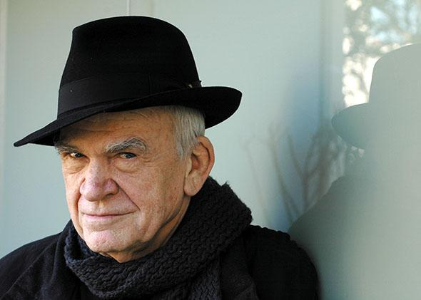

```{r setup, include=FALSE}
knitr::opts_chunk$set(echo = TRUE, 
                      message = FALSE,
                      warning = FALSE)
```


## Milan Kundera and his best-known work

<style>
 .column1 {
  float: left;
  padding: 10px;
}

.left1 {
  width: 30%;
}

.right1 {
  width: 70%;
}

 .column2 {
  float: left;
  padding: 10px;
}

.left2 {
  width: 80%;
}

.right2 {
  width: 20%;
}

/* Clear floats after the columns */
.row:after {
  content: "";
  display: table;
  clear: both;

</style>

<div class="row">
  <div class="column1 left1">
  

  
  </div>

  <div class="column1 right1">
Milan Kundera was born on April 1, 1929 in Czech. He went into exile in France and became a French citizen in 1981. Kundera sees himself as a French writer and sees his works as French literature. His novels usually go beyond the imaginary characters from his figments to construct his philosophical reflections, especially after the publication of his most famous work, _**The Unbearable Lightness of Being**_, in 1984. In this book, Kundera challenges German philosipher Friedrich Nietzsche's idea of eternal recurrence of events and the universe and demostrates a world where everyone only lives once and everything occurs in life only occurs once. 
  </div>
</div>

This demonstration created by Kundera is referred to as the "lightness of being", which signifies freedom for character **Tomas** and **Sabina**, the husband and his lover, but becomes burden for **Tereza**, the wife. Nietzsche's concept is attached to the believe that one occurrence is not significant in this novel, thus is meaningless to try to make better choices. At the end, the book delivers Kundera's believe in that making commitment to a beloved one or a beloved subject is in fact meaningful and desirable because it is such commitment that can lead to true happiness. 

<div class="row">
  <div class="column2 left2">
Tomas begins as a man who has sex with many women but only loves his wife. He believes if he only has one life, "there is no means of testing which decision (in his life) is better, because there is no basis for comparison". Sabina, his mistress and closest friend, lives an extreme life of "lightness" as she expresses satisfaction in the act of betrayal and struggles against the constraints of puritan ancestry and the Communist Party. Tereza never condemns Tomas for his infidelities but she sees herself as a weaker person in the relationship. Influenced by her mother's behavior during her childhood, she always views her body as something disgusting and shameful. After she gets tired of her life with Tomas in Zurich, Tereza returns home to Prague with their dog. At this time, Tomas realizes he cannot live without his wife. He begains to believe commiting to Tereza is a better choice than having many lovers as he used to do. Therefore, Tomas and Tereza moves to countryside where Tomas gives up his obessions of work and need for lovers but discovers the real happiness with Tereza. 
</div>

<div class="column2 right2">


</div>
</div>

Below, I created a wordcloud for the entire novel and compared the proportion of positive and negative sentiment word (from -5 to +5) used by Kundera to all the words included in AFINN sentiment lexicon list of English terms (Nielsen 2011). I also found the top five commonly used words in the most used sentiment groups (from -3 to +3). Through the text analysis of *The Unbearable Lightness of Being*, it is not hard to see the book tells a story of love and betrayal, soul and body, death and life. Kundera uses relatively even numbers of sentimental positive and negative words to portary characters' self contradiction the struggles. His choice of wording keeps the third-person narrative objective and comprehensive while giving readers the first-person angle of understanding to each character. 


## Text mining

```{r}
# attach packages

library(tidyverse)
library(here)
library(paletteer)
library(patchwork)
library(gt)

library(tidytext)
library(textdata)
library(pdftools)
library(ggwordcloud)

```

```{r}
# load the book in pdf

unbearable <- pdf_text(here("data", "the_unbearable_lightness_of_being.pdf"))
```

```{r}
# text wrangling

unbearable_df <- data.frame(unbearable) %>% 
  mutate(text_full = str_split(unbearable, pattern = '\\n')) %>% # split each line to a row
  unnest(text_full) %>% 
  mutate(text_full = str_trim(text_full)) # remove white space

unbearable_token <- unbearable_df %>% 
  unnest_tokens(word, text_full) # get each word (token) in a row
```

```{r}
# remove stop words

unbearable_clean <- unbearable_token %>% 
  anti_join(stop_words) %>% 
  select(word)  

# women and woman, tomas's and tomas means the same thing. They are all high frequency words but were split into two. I changed women to woman, and tomas's to tomas.

unbearable_clean[unbearable_clean$word == "women", 1] <- "woman"

unbearable_clean[unbearable_clean$word == "tomas's", 1] <- "tomas"
```

```{r}
# count the word
unbearable_word <- unbearable_clean %>% 
  count(word) %>% 
  arrange(-n) %>% 
  head(150)
```

### Wordcloud

```{r}
# create word cloud

unbearable_cloud <- ggplot(data = unbearable_word, 
                           aes(label = word,
                               size = n))+
  geom_text_wordcloud_area(aes(color = n), shape = "pentagon") +
  scale_size_area(max_size = 14) +
  scale_color_gradientn(colors = c("darkolivegreen3", "darkorange1", "palevioletred1", "maroon1", "darkorchid1", "darkslateblue")) +
  theme_void()

unbearable_cloud

```

In the wordcloud, Tomas, Tereza, Sabina and Franz (Sabina's lover) are the main characters. Karenin is the dog of Tomas and Tereza. Other high-frequency words reflect the topics discussed in *The Unbearable Lightness of Being*. Whether **love** is the lightness or burden in **life**? What does a **woman** mean to a man? The influence of **mother** on her daughter and **son**. The relationship between **body** and **soul**. 

### Sentimental analysis

#### I. What types of the sentiment are conveyed by the words used by Milan Kundera in *The Unbearable Lightness of Being*?

```{r}
# get the AFINN lexicon list
afinn <- get_sentiments("afinn")

# find word in the book also in the list
unbearable_afinn_all <- unbearable_clean %>% 
  inner_join(afinn) 

# remove repeated ones
unbearable_afinn <- unbearable_afinn_all %>% 
  unique()

# find the proportion of words fall into each sentiment in the book
unbearable_afinn_count <- unbearable_afinn %>% 
  count(value) %>% 
  mutate(proportion = n/sum(n))

# find the proportion of words fall into each sentiment in the list
afinn_value_count <- count(afinn, value) %>% 
  mutate(proportion = n/sum(n))
```

```{r}
# plot proportion of words fall into each sentiment in the list vs. in the book
prop <- ggplot() +
  geom_col(data = afinn_value_count,
           aes(x = fct_reorder(as.factor(value), value),
               y = proportion,
               fill = "")) +
  geom_col(data = unbearable_afinn_count,
           aes(x = fct_reorder(as.factor(value), value),
               y = proportion,
               color = proportion),
           fill = NA) +
  scale_color_paletteer_c("gameofthrones::margaery",
                          direction = 1) +
  scale_x_discrete(labels = c("", "more negative", "", "", "", "neutral", "", "", "", "more positive", "")) +
  scale_fill_manual(values = "gray95") +
  theme_minimal() +
  labs(x = "Token sentiment",
       y = "Proportion",
       fill = "AFINN",
       color = "The book") +
  theme(panel.grid.minor.x = element_blank(),
        panel.grid.major.x = element_blank())

# plot count of words fall into each sentiment in the list vs. in the book
count <- ggplot() +
  geom_col(data = afinn_value_count,
           aes(x = fct_reorder(as.factor(value), value),
               y = n,
               fill = "")) +
  geom_col(data = unbearable_afinn_count,
           aes(x = fct_reorder(as.factor(value), value),
               y = n,
               color = n),
           fill = NA) +
  scale_color_paletteer_c("gameofthrones::margaery",
                          direction = 1) +
  scale_x_discrete(labels = c("", "more negative", "", "", "", "neutral", "", "", "", "more positive", "")) +
  scale_fill_manual(values = "gray95") +
  theme_minimal() +
  labs(x = "Token sentiment",
       y = "Count",
       fill = "AFINN",
       color = "The book") +
  theme(panel.grid.minor.x = element_blank(),
        panel.grid.major.x = element_blank())
```

Comparing the words used by Kundera in his most famous book to the AFINN lexicon list of wording sentiments, there are slightly higher proportion of words with slightly positive sentiments or less negative sentiments (Figure 1). Words associated with more neutral sentiments have higher proportion in *The Unbearable Lightness of Being* than in the lexixon collection.

```{r}
# plot in patch
prop + count
```

_**Figure 1: Word sentiments in the whole collection of AFINN lexicon list vs. in the Kundera's book.** Light gray bars represent the proportion/count distribution of AFINN lexicon list. Colored bars represent the distribution in *The Unbearable Lightness of Being*. _

<br>

#### II. What are the words with +4 and +5 sentimental ranks?

```{r}
unbearable_positive <- unbearable_afinn_all %>% 
  filter(value >= 4) %>% 
  arrange(desc(value)) %>% 
  count(word, value)
```

```{r}
unbearable_positive %>% 
  gt() %>% 
  tab_options(container.height = 400,
              container.overflow.y = TRUE,
              table.align = "left") %>% 
  tab_header(title = "Table 1: Most positive words in The Unbearable Lightness of Being") %>% 
  cols_label(word = "Word",
             value = "Postive rank",
             n = "Times used in the book") %>% 
  data_color(columns = vars(value),
             colors = scales::col_numeric(
               palette = c("rosybrown1","indianred1"),
               domain = c(4, 5)
             ),
             alpha = 0.4) %>% 
  data_color(columns = vars(n),
             colors = scales::col_numeric(
               palette = c("lightskyblue1", "steelblue3"),
               domain = c(1, 6)
             ),
             alpha = 0.4)
```

Table 1 lists the most positive words used by Kundera in the book. **Breathtaking** and **thrilled** are the most positive words, each used once. The most common positive words are **fun** (used 6 times), **overjoyed** (used 5 times), and **win** (used 5 times).

<br>

#### III. What are the top five popular words in each of the AFINN sentimental bins from rank -3 to 3 in the book?

```{r}
# top 5 words in bins from -3 to 3
unbearable_afinn_top5 <- unbearable_afinn_all %>% 
  filter(value >= -3 & value <= 3 & value != 0) %>% 
  count(word, value, sort = TRUE) %>% 
  group_by(value) %>% 
  dplyr::top_n(5) %>% 
  mutate(alpha = n/max(n)*8)
```

I summarized the five most commonly used words in more common sentimental groups (-3 to +3) in *The Unbearable Lightness of Being*. The words and their counts in the book are plotted below in the sentimental group they are in (Figure 2). Particularly, **love** is mentioned more than 200 times in the book, which is much higher than other most common words in each group. Words related to **Death** (i.e. died and dead) are the most common negative words. Indeed, love and death are the central themes in the book. 

```{r}
# create label for the value of sentiments
value_lab <- c("more negative", "negative", "less negative", "less positive", "positive", "more positive")
names(value_lab) <- c("-3", "-2", "-1", "1", "2", "3")

# plot the top five 
ggplot(data = unbearable_afinn_top5,
       aes(x = fct_reorder(word, n),
           y = n))  +
  geom_col(fill = "white") +
  geom_col(aes(fill = fct_reorder(as.factor(value), value),
               alpha = alpha),
           show.legend = FALSE)  +
  scale_fill_paletteer_d("rcartocolor::Fall") +
  facet_wrap(~value, 
             ncol = 3, 
             scales = "free", 
             labeller = labeller(value = value_lab)) +
  theme_minimal() +
  labs(x = "Words",
       y = "Count") +
  theme(panel.grid.minor.x = element_blank(),
        panel.grid.major.x = element_line(size = 0.3),
        panel.grid.major.y = element_blank()) +
  coord_flip()
```

_**Figure 2: Top five words in each sentimental bins.** More positive words are colored with warmer colors and more frequent words have higher opacity. The scale of count varied for all six groups. Love is most common in the more positive group (+3) and over all. _

<br>

#### IV. Not all words in the book are in the AFINN lexicon list

```{r}
# what words are not included in the sentimental analysis
unbearable_afinn_out <- unbearable_clean %>% 
  full_join(afinn) %>% 
  filter(is.na(value))
```

Only `r count(unbearable_afinn)[[1]]` words used by Kundera in *The Unbearable Lightness of Being* are included in the AFINN lexicon list, `r count(unique(unbearable_afinn_out))[[1]]` are not included. **Woman**, **time**, and **life** are the three most commonly used words that are not ranked for sentiment in the AFINN lexicon list (Figure 3). 

```{r}
# find the top 10 common words not inthe AFINN list except the character names
unbearable_afinn_out_top10 <- unbearable_afinn_out %>% 
  count(word) %>% 
  filter(!word %in% c("tomas", "tereza", "sabina", "franz")) %>% # remove character names
  arrange(-n) %>% 
  head(10) 

ggplot(data = unbearable_afinn_out_top10,
       aes(y = fct_reorder(word, n),
           x = n)) +
  geom_point(aes(size = n,
                 color = n),
             show.legend = FALSE) +
  geom_segment(aes(x = 0,
                   y = word,
                   xend = n,
                   yend = word,
                   color = n),
               show.legend = FALSE) +
  theme_minimal() +
  labs(x = "Count",
       y = "")+
  scale_color_paletteer_c("pals::kovesi.diverging_isoluminant_cjo_70_c25",
                          direction = 1) +
  theme(axis.text.y = element_text(face = "bold",
                                   size = 10))
```

_**Figure 3: Common words in the book but not in the AFINN lexicon list.** Most commonly used words are plotted with warmer color and larger bubble size represent higher frequency in the book._

<br>

## Reference

Nielsen, F. Å. 2011. A new ANEW: Evaluation of a word list for sentiment analysis in microblogs. CoRR abs/1103.2903.

