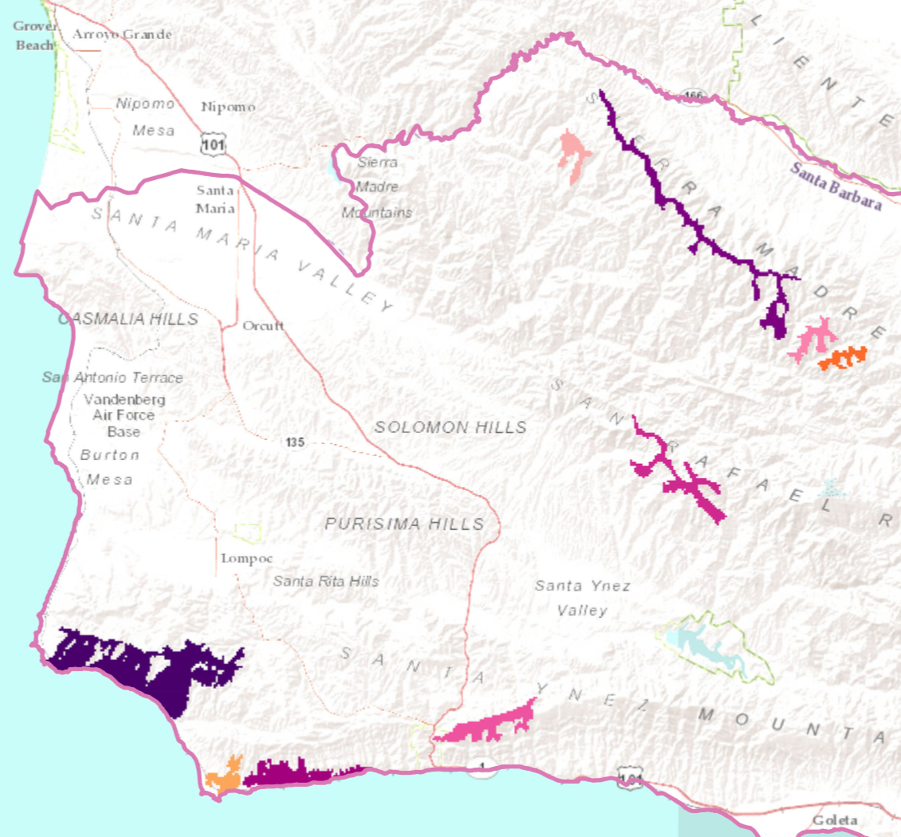

   

<h2>GIS&emsp;&emsp;&emsp;</h2>

   

  

  <h4>Sea level rise in Santa Barbara, CA</h4>
  
    
  
This project was part of the curriculum of <a href="https://frew.eri.ucsb.edu/private/ESM263/">ESM 263</a>
  

  ArcMap
  

  

  <h4>Potential wind turbine sites in Santa Barbara, CA</h4>
  
    
  
This project was part of the curriculum of <a href="https://frew.eri.ucsb.edu/private/ESM263/">ESM 263</a> 
  

  
See the <a href="projects/gis/sb_wind_turbines_site.tbx">model</a> for this project
  

  ArcMap
  
  

  

  <h4>Watershed Conservation Priorities in Santa Barbara, CA</h4>
  
    
  
This project was part of the curriculum of <a href="https://frew.eri.ucsb.edu/private/ESM263/">ESM 263</a>
  

  ArcMap Multicriteria Analysis
  

  

  

           

  <button type="button" class="btn btn-primary disabled"><a href="project.html" style="color:white">Data in R</a></button>
  <button type="button" class="btn btn-primary disabled"><a href="paper.html" style="color:white">Paper</a></button>

