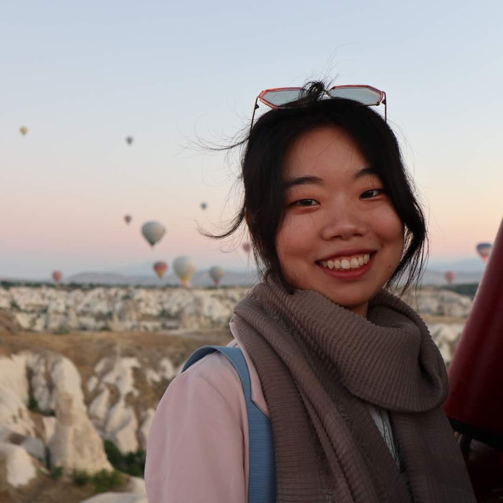

```{r setup, include=FALSE}
knitr::opts_chunk$set(echo = TRUE)
```
<style>
.image-cropper {
  width: 300px;
  height: 300px;
  position: relative;
  overflow: hidden;
  border-radius: 50%;
}

img.crop {
  display: inline;
  margin: 0 auto;
  height: 100%;
  width: auto;
}
</style>

<br><br>

<center>
<div class="image-cropper">
  
</div>
</center>
<br>

<p style="font-size:18px">
Shuhan is a **Data Analyst** on the Validation and Assessment team at CALSTART, a non-profit organization in the <font colot="#1569C7">clean transportation industry</font>. Her responsibilities include <font color="#D58A94">collecting, validating, analyzing, and visualizing data</font>. Shuhan is a wizard when it comes to building <font color="#6A287E">mathematical models</font>, <font color="#B5A642">interactive dashboards</font>, <font color="#5865F2">web-based tools</font>, and <font color="#C04000">R packages</font> (you should definitely ask her about them!). She discovered her love for programming in R during her master's degree at <font color="#008B8B">Bren School, UC Santa Barbara</font>, and considers herself fortunate to continue using it to promote a <font color="#8FBC8F">cleaner, greener, and more sustainable environment and society</font>. 
</p>
<br>
<p style="font-size:18px">
Shuhan's career has encompassed <font color="#8B8000">conservation</font>, <font color="#872657">biodiversity</font>, and <font color="#7575CF">environmental research</font>, and she has a deep appreciation for both fieldwork and computer-based tasks such as coding and mapping. Originally from <font color="#FBB117">Beijing, China</font>, Shuhan is fluent in both <font color="steelblue">English and Mandarin</font>. When she's not being a data whiz, she can be found indulging in her hobbies, such as <font color="palevioletred">watercolor painting</font>, <font color="orange">crocheting</font>, <font color="skyblue">solving puzzles</font>, <font color="olivedrab">hiking</font>, <font color="mediumorchid">visiting museums</font>, <font color="#43C6DB">cuddling</font> with [<u>her adorable cat</u>](about_me/rice.jpg), and listening to <font color=#C19A6B>jazz and violin solos</font> (you must check out this amazing performance of the [<u>Violin Concerto No. 1 in D Major</u>](https://www.youtube.com/watch?v=rNM1CkCfjsk) by Mengla Huang and the string quintet).
</p>


<br><br>

<!-- <div  align="center" id="footer"> -->
  <!-- <button type="button" class="btn btn-primary disabled"><a href="data_in_r.html" style="color:white">Data in R</a></button> -->
  <!-- <button type="button" class="btn btn-primary disabled"><a href="gis.html" style="color:white">GIS</a></button> -->
  <!-- <button type="button" class="btn btn-primary disabled"><a href="paper.html" style="color:white">Paper</a></button> -->
  <!-- <button type="button" class="btn btn-primary disabled"><a href="gallery.html" style="color:white">Gallery</a></button> -->
<!-- </div> -->