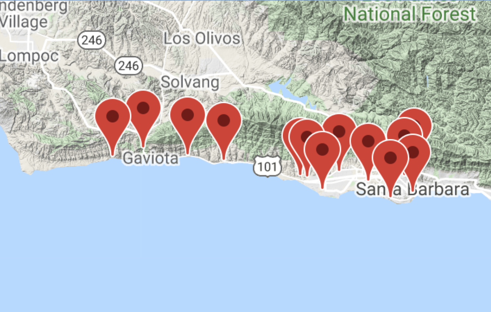
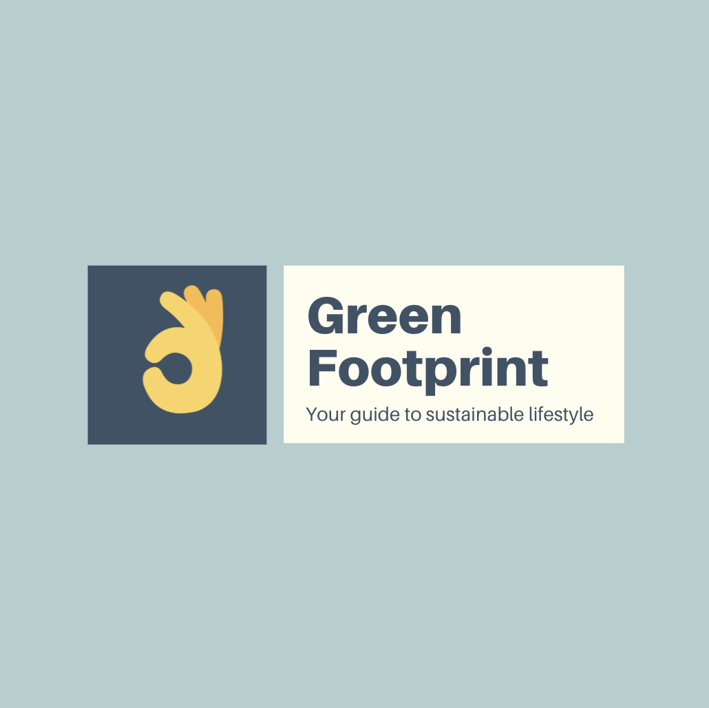

```{r setup, include=FALSE}
knitr::opts_chunk$set(echo = FALSE)
```

<style>
.column {
  float: left;
  padding: 10px;
}

.left {
  width: 50%;
}

.right {
  width: 50%;
}

.row:after {
  content: "";
  display: table;
  clear: both;
}

</style>

<br><br><br>

<center>

<h2>Data analysis in R&emsp;&emsp;&emsp;&emsp;</h2>

</center>

<br><br><br>

<div class="row">
<div class="column left">
<h4>Agriculture and watersheds in Hawaii</h4>
  <a href="projects/map_hawaii.html">
    
  </a>
  <br><br>
    <p>see <a href="projects/map_hawaii_code.html">code</a> behind</p>
  <span class="badge" >Map</span>
  
</div>
<div class="column right">
<h4>Santa Barbara Creek Chemistry</h4>
<a href="projects/sb_creek.html">
    
  </a>
  <br><br>
    <p>see <a href="projects/sb_creek_code.html">code</a> behind
    </p>
  <span class="badge" >MLR</span> <span class="badge" >PCA</span> <span class="badge" >Clustering</span>
</div>
</div>


<br>


<div class="row">
<div class="column left">
<h4>Snowshoe hares in Alaska</h4>
  <a href="projects/snowshoe.html">
    
  </a>
<br><br>
<span class="badge" >Basic</span>
</div>
<div class="column right">
<h4>Nutrients in vegan vs. non-vegan</h4>
  <a href="projects/nutrient.html">
    
  </a>
<br><br>
<span class="badge" >PCA</span>
</div>
</div>

<br>

<div class="row">
<div class="column left">
<h4>Steelhead passing the Bonneville Dam</h4>
  <a href="projects/steelhead_salmon_migration.html">
    
  </a>
  <br><br>
  <p>see <a href="projects/steelhead_salmon_migration_code.html">code</a> behind
  </p>
  <span class="badge">Time Series</span>

  
</div>
<div class="column right">
<h4>Milan Kundera</h4>
  <a href="projects/text_mining_on_the_unbearable.html">
    
  </a>
  <br><br>
  <p>see <a href="projects/text_mining_on_the_unbearable_code.html">code</a> behind</p>
  <span class="badge" >Text mining</span>
  
</div>
</div>


<br>


<div class="row">
<div class="column left">
<h4>Green Footprint</h4>
  <a href="https://ruoyuwang.shinyapps.io/GreenFootprint/">
    
  </a>
  <br><br>
    <p>see the <a href="https://devpost.com/software/greentrack-ss-rw">story</a> and <a href="https://github.com/Ruoyu-Wang108/greentrack-ss-rw">GitHub Repo</a>
    </p>
  <span class="badge" >Shinyapp</span>
</div> 
<div class="column right">
<h4>AnimalDex</h4>
      
<br>
  <span class="badge" >Shinyapp</span>
</div>
</div>

<br>


<br><br>


<div  align="center" id="footer">
  <button type="button" class="btn btn-primary disabled">
    <a href="index.html" style="color:white">Home</a>
  </button>
  <button type="button" class="btn btn-primary disabled">
    <a href="gis.html" style="color:white">GIS</a>
  </button>
</div>