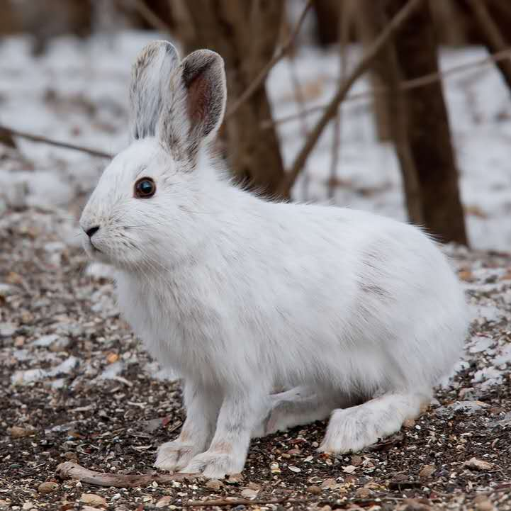

```{r setup, include=FALSE}
knitr::opts_chunk$set(echo = FALSE)
```

<style>
  .col2 {
    columns: 2 200px;         /* number of columns and width in pixels*/
    -webkit-columns: 2 200px; /* chrome, safari */
    -moz-columns: 2 200px;    /* firefox */
  }
</style>

<br>


<div class="col2">
<h4>**Snowshoe hares in Alaska**</h4>
<a href="projects/snowshoe.html">
    
</a>
<br><br>
<span class="badge" >Basic</span>


<h4>**Nutrients in vegan vs. non-vegan**</h4>
<a href="projects/nutrient.html">
    
</a>
<br><br>
<span class="badge" >PCA</span>

</div>

<br>

<div class="col2">

<h4>**Steelhead passage across the Bonneville Dam**</h4>
  <a href="projects/steelhead_salmon_migration.html">
    
  </a>
  <br>
  
  <p>see <a href="projects/steelhead_salmon_migration_code.html">code</a> behind </p>
  <span class="badge" >Time Series</span>


<h4>**Agricultural land use and watersheds in Hawaii**</h4>

<a href="projects/map_hawaii.html">
    
  </a>
  <br>
  <p>see <a href="projects/map_hawaii_code.html">code</a> behind</p>
  <span class="badge" >map</span>
  
  <br><br><br><br><br><br><br>
</div>


<br>


<div class="col2">
<h4>**Green Footprint**</h4>
<a href="https://ruoyuwang.shinyapps.io/GreenFootprint/">
    
  </a>
  <br>
  <p>see the <a href="https://devpost.com/software/greentrack-ss-rw">story</a> and <a href="https://github.com/Ruoyu-Wang108/greentrack-ss-rw">GitHub Repo</a></p>
  <span class="badge" >Shinyapp</span>


<h4>**AnimalDex**</h4>
  <br><br><br><br><br><br><br>  <br><br>     <br><br><br><br><br><br><br> <br><br><br><br><br><br><br>
</div>


